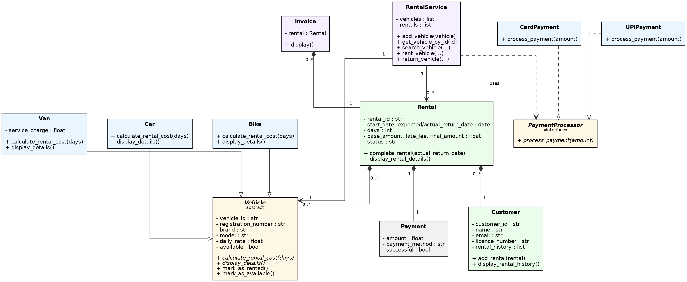

# Vehicle Rental Management System

## Project Description

This project is a Vehicle Rental Management System developed using Python and Object-Oriented Programming (OOP).

The system allows customers to rent vehicles such as cars, bikes, and vans. It manages vehicle availability, customer information, rental records, payments, vehicle returns, late fees, invoices, and rental history.

## Project Structure

```text
vehicle_rental_system/
│
├── models/
│   ├── __init__.py
│   ├── customer.py
│   ├── rental.py
│   └── vehicle.py
│
├── payment/
│   ├── __init__.py
│   └── payment.py
│
├── services/
│   ├── __init__.py
│   └── rental_service.py
│
├── invoice.py
├── main.py
├── interactive_app.py
├── CONSOLE_OUTPUT.md
├── DISCUSSION_QUESTIONS.md
├── TEST_CASES.md
├── CLASS_DIAGRAM.png
├── README.md
└── .gitignore
```

## Class Responsibilities

| Class / File | Key Data | Key Responsibilities |
|---|---|---|
| `Vehicle` (abstract) — `models/vehicle.py` | vehicle ID, registration number, brand, model, daily rate, availability | Defines shared vehicle behaviour: `calculate_rental_cost()`, `display_details()`, `mark_as_rented()`, `mark_as_available()` |
| `Car` — `models/vehicle.py` | inherits from `Vehicle` | Rental cost = daily rate × days |
| `Bike` — `models/vehicle.py` | inherits from `Vehicle` | Rental cost = daily rate × days, with a 5% discount when rented for more than 5 days |
| `Van` — `models/vehicle.py` | adds `service_charge` | Rental cost = (daily rate × days) + service charge |
| `Customer` — `models/customer.py` | customer ID, name, email, licence number, rental history | Validates registration input, tracks and displays rental history |
| `Rental` — `models/rental.py` | rental ID, customer, vehicle, dates, days, amounts, status | Composes a `Customer`, `Vehicle`, and `Payment`; calculates late fee and final amount on return |
| `Payment` — `payment/payment.py` | amount, payment method, success flag | Stores the outcome of a processed transaction |
| `PaymentProcessor` (abstract) — `payment/payment.py` | — | Defines the `process_payment(amount)` contract |
| `CardPayment` / `UPIPayment` — `payment/payment.py` | inherit from `PaymentProcessor` | Provide concrete payment processing so `RentalService` never depends on a specific payment type |
| `RentalService` — `services/rental_service.py` | list of vehicles, list of rentals | Adds vehicles, searches/filters vehicles, orchestrates the rent and return workflow |
| `Invoice` — `invoice.py` | a completed `Rental` | Formats and displays the final invoice for a rental |

## OOP Concepts Used

- **Encapsulation** — Protecting important data using private class attributes and controlled access through properties.
- **Abstraction** — Using abstract classes for `Vehicle` and `PaymentProcessor`.
- **Inheritance** — `Car`, `Bike`, and `Van` inherit from `Vehicle`; `CardPayment` and `UPIPayment` inherit from `PaymentProcessor`.
- **Polymorphism** — Different vehicle types implement their own rental cost calculation.
- **Method Overriding** — Child classes provide their own implementation of inherited methods.
- **Composition** — `Rental` contains `Customer`, `Vehicle`, and `Payment` objects.
- **Exception Handling** — Used for unavailable vehicles, invalid rental duration, and payment failures.

## Features

- Add and manage vehicles
- Support for Car, Bike, and Van
- Register customers
- Display available vehicles
- Search vehicles by ID, type, or price range
- Check vehicle availability
- Calculate rental cost
- Card and UPI payment processing
- Confirm rental after successful payment
- Return vehicles
- Calculate late fees
- Generate invoices
- Maintain customer rental history

## How to Run

Open the project folder in Visual Studio Code, open the terminal, and run one of the following depending on which version you want. If `python` does not work on your system, try `python3` instead.

**Scripted demonstration (fixed scenario, matches the assignment's mandatory demo):**

```
python main.py
```

**Interactive console application (register yourself and use a live menu):**

```
python interactive_app.py
```

### About interactive_app.py

This is a real-life style version of the same system. Instead of hard-coded customers, you register yourself first (name, email, licence number), and then use a numbered menu to:

1. View your registration details
2. View or search available vehicles (by type or price range)
3. Rent a vehicle (choose a vehicle, number of days, and pay by Card or UPI)
4. View your active rentals
5. Return a vehicle (enter the actual return date to see the late fee applied)
6. Get the final invoice for a completed rental
7. View your full rental history
8. Exit

It reuses the exact same classes (`Vehicle`, `Customer`, `Rental`, `PaymentProcessor`, `RentalService`, `Invoice`) as `main.py` — only the input source changes, from hard-coded values to `input()` prompts.

## Demonstration

Running `main.py` demonstrates the assignment's mandatory scenario:

1. Adding vehicles.
2. Registering customers.
3. Displaying available vehicles.
4. Customer A renting a car for 3 days.
5. Customer B attempting to rent the same car.
6. Rejecting the second rental because the vehicle is unavailable.
7. Processing Customer A's payment.
8. Returning the car one day late.
9. Calculating the late fee.
10. Generating the final invoice.
11. Making the car available again.
12. Displaying the customer's rental history.

The captured console output of this run is saved in [`CONSOLE_OUTPUT.md`](CONSOLE_OUTPUT.md) as submission evidence, alongside the written test cases in [`TEST_CASES.md`](TEST_CASES.md).

## Class Diagram



The class diagram shows the inheritance, composition, and associations used in the Vehicle Rental Management System.

## Polymorphism

Polymorphism is used through the `calculate_rental_cost()` method in the `Vehicle` class.

Car, Bike, and Van override this method and provide their own rental cost calculation.

The `RentalService` can call `vehicle.calculate_rental_cost(days)` without checking the type of vehicle.

This makes the program easier to maintain and allows new vehicle types to be added without changing the existing rental logic.

## Discussion Questions

Written answers to the assignment's discussion questions are available in [`DISCUSSION_QUESTIONS.md`](DISCUSSION_QUESTIONS.md).

## Requirements

- Python 3.x
- No external libraries are required.

## Author

Vehicle Rental Management System
